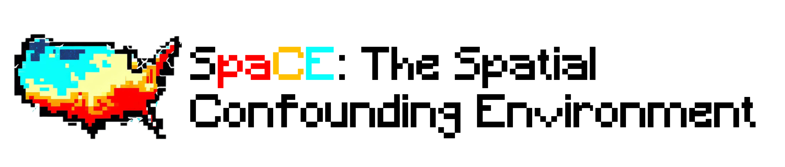

[](https://www.doi.org/10.7910/DVN/SYNPBS)
[](https://github.com/NSAPH-Projects/space)
[](https://pypi.org/project/spacebench)


## 🚀 Description

This code repository is part of SpaCE (Spatial Confounding Environment), designed to address the challenge of spatial confounding in scientific studies involving spatial data. Spatial confounding occurs when unobserved spatial variables influence both the treatment and outcome, potentially leading to misleading associations. SpaCE offers benchmark datasets, each including training data, true counterfactuals, a spatial graph with coordinates, and scores characterizing the effect of a missing spatial confounder. The datasets encompass diverse domains such as climate, health, and social sciences. 

In this repository, you will find the code for generating realistic semi-synthetic outcomes and counterfactuals using state-of-the-art machine learning ensembles, following best practices for causal inference benchmarks. To obtain the predictor $f$ and the spatial distribution of observed residuals $R$, the package employs AutoML techniques implemented with the AutoGluon package in Python. AutoGluon trains an ensemble of models and selects the best one based on cross-validation, including the performance-weighted ensemble.

Please refer to [the main SpaCE repository]((https://github.com/NSAPH-Projects/space)) and [documentation](https://nsaph-projects.github.io/space/) for detailed instructions on using SpaCE and maximizing its capabilities for addressing spatial confounding in your scientific studies.

## 🐍 Installation

To get started with the SpaCE Data, create a conda environment with the following commands:

```
conda env create -f requirements.yaml
conda activate spacedata
```

Please note that the creation of the conda environment may fail on Intel-based Macs. In such cases, we recommend using the Dockerfile available in the repository.


## Reproducibility pipeline of all spaceenv for spacebench

To reproduce all the spaceenvs, simply run the following command:

```bash
export <DATAVERSE_TOKEN>=xxxxxxxx-xxxx-xxxx-xxxx-xxxxxxxxxxxxoad.py spaceenv=<spaceenv> 
snakemake -j --configfile conf/pipeline.yaml -C dataverse=demo upload=true
```

Here `dataverse=demo` indicates the dataverse where the data will be uploaded. See the [upload](#uploading) section. To run everything without uploading the data, remove the `upload=true` flag.

Snakemake will make sure not too run things twice when they have been already trained and uploaded.


## 🐢 Getting started

Creating a dataset consists of two steps: training a spaceenv and uploading it to dataverse. In addition, you need to make sure that the the data collection used by a spaceenv exists.

### Preparing a data collection

### Training

To create and train a new dataset, add a config file in `conf/spaceenv`. Look at `conf/spaceenv/elect_dempct_college.yaml` for inspiration. The elements marked with `???` under the `spaceenv` field in `conf/config.yaml` are mandatory.

To train the model and generate counterfactuals, run the following command:

```
python train_spaceenv.py spaceenv=<config_file_name>
```

For example, you can use `python train_spaceenv.py spaceenv=elect_dempct_college` to train the `elect_dempct_college` space environment. In general, `<config_file_name>` can be any of the config files in `conf/spaceenv/`. The config files are `.yaml` files that contain the parameters for the training. The `spaceenv` parameter is mandatory and it should be the name of the config file without the `.yaml` extension.

The outputs will be saved in `trained_spaceenvs/<spaceenv>`. The outputs are:
 - `synthetic_data.csv`: data frame with all the synthetic and real data 
 - `metadata.yaml`: info about the generated data (column names, features importance, etc.)
 - `leaderboard.csv`: results from `autogluon` fit.
 - `counterfactuals.png` image with generated potential outcome curves, it gives a good idea of the confounding


### Uploading

You will need a Harvard (or other) Dataverse API token to upload the dataset in the SpaCE collection. Export it as an environment variable as follows:

```
export <DATAVERSE_TOKEN>=xxxxxxxx-xxxx-xxxx-xxxx-xxxxxxxxxxxxoad.py spaceenv=<spaceenv> dataverse=<dataverse>
```

Each dataverse destination can have a different token. These name of the token is specified at `conf/dataverse/<dataverse>.yaml` under the field token (e.g. token=HARVARD_DATAVERSE_TOKEN).

Use the flag `upload=false` to avoid uploading the dataset. The upload script will still prepare the directory and zip file for upload under `uploads/<spaceenv>`. This is useful for testing the pipeline or run things locally with new collections and environments.


## List of available Space Envs

List of supported `SpaceEnvs`.

| Dataset                             | Treatment type   |
| ----------------------------------- | ---------- |
| healthd_dmgrcs_mortality_disc       | binary     |
| cdcsvi_limteng_hburdic_cont         | continuous |
| climate_relhum_wfsmoke_cont         | continuous |
| climate_wfsmoke_minrty_disc         | binary     |
| healthd_hhinco_mortality_cont        | continuous |
| healthd_pollutn_mortality_cont       | continuous |
| county_educatn_election_cont         | continuous |
| county_phyactiv_lifexpcy_cont       | continuous |
| county_dmgrcs_election_disc          | binary     |
| cdcsvi_nohsdp_poverty_cont           | continuous |
| cdcsvi_nohsdp_poverty_disc           | binary     |


For more information and descriptions of the provided datasets, please refer to the README file within the `data/` folder. Each dataset is documented in a corresponding markdown file located inside the `data/` folder.

## 👽 Contact

Contributions to this project are appreciated and encouraged from the external community. If you have a suggestion, bug reports, or would like to contribute new features, we invite you to engage with us by opening an issue or a pull request in the repository.
