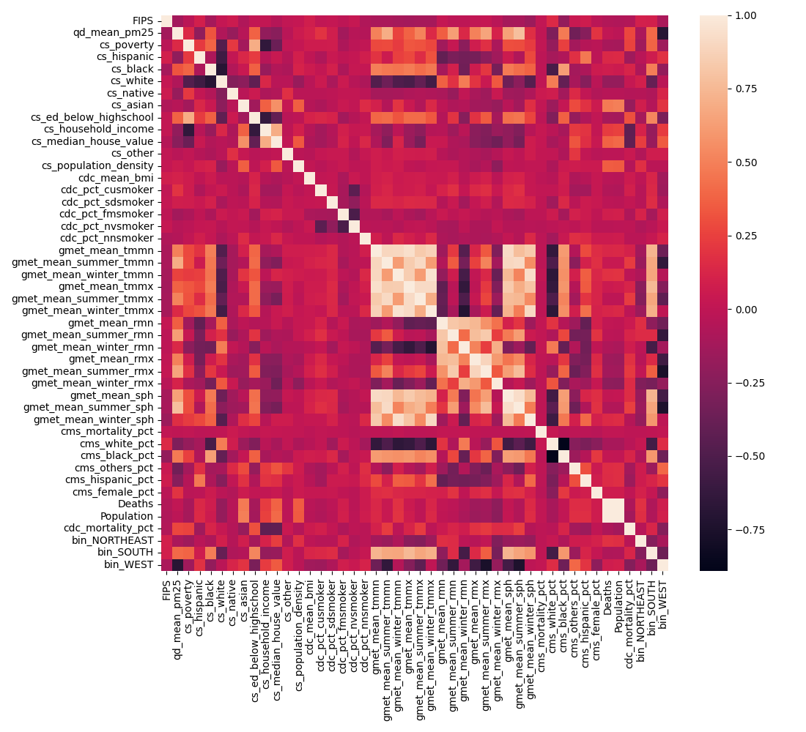

# Overview

| Properties             | Value                                                                                                                                                                                                                    |
|:-----------------------|:-------------------------------------------------------------------------------------------------------------------------------------------------------------------------------------------------------------------------|
| Description            | The dataset incorporates all-cause mortality data sourced from the CDC, along with a range of demographic and environmental variables, including data on temperature and air pollution, all pertaining to the year 2010. |
| Spatial Coverage       | Continental USA                                                                                                                                                                                                          |
| Spatial Resolution     | county                                                                                                                                                                                                                   |
| Temporal Coverage      | 2010                                                                                                                                                                                                                     |
| Temporal Resolution    | annual                                                                                                                                                                                                                   |
| Original Data Sources  | https://dataverse.harvard.edu/dataset.xhtml?persistentId=doi:10.7910/DVN/L7YF2G and https://wonder.cdc.gov/controller/datarequest/D77                                                                                    |
| Data Processing Code   | `notebooks/103_air_pollution.ipynb`                                                                                                                                                                                      |
| Data Location          | https://drive.google.com/drive/folders/1De4e2DJhP1gzL5r-l9dXw4Jpa48imDH5?usp=sharing                                                                                                                                     |
| Number of Variables    | 48                                                                                                                                                                                                                       |
| Number of Observations | 3142                                                                                                                                                                                                                     |
| Missing Cells          | 985                                                                                                                                                                                                                      |
| Missing cells (%)      | 31.349458943348186%                                                                                                                                                                                                      |
| Duplicate Rows         | 0                                                                                                                                                                                                                        |
| Duplicate Rows (%)     | 0.0%                                                                                                                                                                                                                     |
| Total Size In Memory   | 1.15076 MB                                                                                                                                                                                                               |

# Variables

| Variable Name | Description |
| ------------- | ----------- |
| `qd_mean_pm25` | Mean PM2.5 air pollution level. PM2.5 refers to atmospheric particulate matter with a diameter of less than 2.5 micrometers. |
| `cs_poverty` | Count or percentage of individuals living in poverty. |
| `cs_hispanic` | Population count identifying as Hispanic. |
| `cs_black` | Population count identifying as Black. |
| `cs_white` | Population count identifying as White. |
| `cs_native` | Population count identifying as Native American. |
| `cs_asian` | Population count identifying as Asian. |
| `cs_ed_below_highschool` | Population count with an educational attainment level below high school. |
| `cs_household_income` | Average household income in the area. |
| `cs_median_house_value` | Median value of houses in the area. |
| `cs_other` | Population count identifying as other than the specified races. |
| `cs_population_density` | Population density in the area (population per square mile). |
| `cdc_mean_bmi` | Mean body mass index (BMI) as recorded by the Centers for Disease Control and Prevention. |
| `cdc_pct_cusmoker` | Percentage of current smokers as recorded by the CDC. |
| `cdc_pct_sdsmoker` | Percentage of individuals who smoke some days as recorded by the CDC. |
| `cdc_pct_fmsmoker` | Percentage of individuals who smoke every day as recorded by the CDC. |
| `cdc_pct_nvsmoker` | Percentage of individuals who never smoked as recorded by the CDC. |
| `cdc_pct_nnsmoker` | Percentage of individuals who do not smoke now as recorded by the CDC. |
| `gmet_mean_tmmn` | Mean minimum temperature as recorded by Global Meteorological data. |
| `gmet_mean_summer_tmmn` | Mean minimum temperature during summer as recorded by Global Meteorological data. |
| `gmet_mean_winter_tmmn` | Mean minimum temperature during winter as recorded by Global Meteorological data. |
| `gmet_mean_tmmx` | Mean maximum temperature as recorded by Global Meteorological data. |
| `gmet_mean_summer_tmmx` | Mean maximum temperature during summer as recorded by Global Meteorological data. |
| `gmet_mean_winter_tmmx` | Mean maximum temperature during winter as recorded by Global Meteorological data. |
| `gmet_mean_rmn` | Mean minimum rainfall as recorded by Global Meteorological data. |
| `gmet_mean_summer_rmn` | Mean minimum rainfall during summer as recorded by Global Meteorological data. |
| `gmet_mean_winter_rmn` | Mean minimum rainfall during winter as recorded by Global Meteorological data. |
| `gmet_mean_rmx` | Mean maximum rainfall as recorded by Global Meteorological data. |
| `gmet_mean_summer_rmx` | Mean maximum rainfall during summer as recorded by Global Meteorological data. |
| `gmet_mean_winter_rmx` | Mean maximum rainfall during winter as recorded by Global Meteorological data. |
| `gmet_mean_sph` | Mean specific humidity as recorded by Global Meteorological data. |
| `gmet_mean_summer_sph` | Mean specific humidity during summer as recorded by Global Meteorological data. |
| `gmet_mean_winter_sph` | Mean specific humidity during winter as recorded by Global Meteorological data. |
| `cms_mortality_pct` | Percentage of mortality as recorded by the Centers for Medicare & Medicaid Services. |
| `cms_white_pct` | Percentage of white individuals as recorded by the Centers for Medicare & Medicaid Services. |
| `cms_black_pct` | Percentage of black individuals as recorded by the Centers for Medicare & Medicaid Services. |
| `cms_others_pct` | Percentage of individuals identifying as other races as recorded by the Centers for Medicare & Medicaid Services. |
| `cms_hispanic_pct` | Percentage of individuals identifying as Hispanic as recorded by the Centers for Medicare & Medicaid Services. |
| `cms_female_pct` | Percentage of female individuals as recorded by the Centers for Medicare & Medicaid Services. |
| `Notes` | Additional notes or comments related to the data. |
| `County` | Name of the county. |
| `Deaths` | Total number of deaths in the area as recorded by the CDC. |
| `Population` | Total population of the area. |
| `Crude Rate` | Crude death rate in the area. |
| `cdc_mortality_pct` | Percentage of deaths as recorded by the Centers for Disease Control and Prevention. |
| `bin_NORTHEAST` | Binary variable indicating whether the location is in the Northeast region of the United States. |
| `bin_SOUTH` | Binary variable indicating whether the location is in the Southern region of the United States. |
| `bin_WEST` | Binary variable indicating whether the location is in the Western region of the United States. |

# Correlations

# Sample

|   fips |   noaa_prcp |   noaa_snow |   noaa_temp |   noaa_altitude |   noaa_temp_jan |   noaa_temp_apr |   noaa_temp_jul |   noaa_temp_oct |   cs_male |   cs_female |   population/2019 |   cdc_suicides |   cdc_homicides |   cdc_vehicle_deaths |   bls_labor_force |   bls_employed |   bls_unemployed |   life-expectancy |   cdc_police_deaths_total |   cdc_police_deaths_unarmed |   police_deaths |   avg_income |   cs_ed_below_highschool |   cs_ed_highschool |   cs_ed_some_college |   cs_ed_above_college |   poverty-rate |   bls_living_wage |   bls_food_costs |   bls_medical_costs |   bls_housing_costs |   bls_tax_costs |   health_poor_health_pct |   health_smokers_pct |   health_obese_pct |   health_phy_inactive_pct |   health_children_poverty_pct |   health_80th_perc_income_pct |   health_20th_perc_income_pct |   cs_age-to-25 |   cs_age-25-65 |   cs_age-over-65 |   cs_white |   cs_black |   cs_asian |   cs_hispanic |   election_dem_pct |
|-------:|------------:|------------:|------------:|----------------:|----------------:|----------------:|----------------:|----------------:|----------:|------------:|------------------:|---------------:|----------------:|---------------------:|------------------:|---------------:|-----------------:|------------------:|--------------------------:|----------------------------:|----------------:|-------------:|-------------------------:|-------------------:|---------------------:|----------------------:|---------------:|------------------:|-----------------:|--------------------:|--------------------:|----------------:|-------------------------:|---------------------:|-------------------:|--------------------------:|------------------------------:|------------------------------:|------------------------------:|---------------:|---------------:|-----------------:|-----------:|-----------:|-----------:|--------------:|-------------------:|
|  31039 |        30.5 |        28.2 |        48.8 |           418.2 |            20.9 |            49   |            74.9 |            50.8 |      4435 |        4411 |              8846 |        0.47619 |       nan       |              1.95238 |              4830 |           4708 |              122 |             81.2  |                         0 |                           0 |               0 |        58610 |                     11.6 |               35.1 |                 29.5 |                  23.8 |            8.9 |             12.89 |             3246 |                2783 |                5460 |            5385 |                  14.5906 |              16.2698 |               39.2 |                      25.3 |                          10.4 |                        103361 |                         27300 |       0.321275 |       0.455121 |         0.223604 |   0.875763 | 0.00531314 | 0.00486095 |     0.103324  |            19.5462 |
|  31109 |        31   |        25.3 |        51   |           392.4 |            24.1 |            50.9 |            76.8 |            52.9 |    160211 |      158879 |            319090 |       33.381   |         5.28571 |             25.0476  |            177006 |         169507 |             7499 |             80.46 |                         0 |                           0 |               0 |        49889 |                      6.3 |               21.5 |                 32.6 |                  39.5 |           10.7 |             14.72 |             3246 |                2783 |                7452 |            7197 |                  12.5342 |              16.4308 |               29.8 |                      17.3 |                          10.6 |                        114731 |                         27068 |       0.374462 |       0.481685 |         0.143853 |   0.806309 | 0.0429127  | 0.0479583  |     0.0738569 |            52.7212 |
|  31129 |        27.7 |        22.2 |        51.5 |           521.2 |            25.6 |            51   |            77.1 |            52.8 |      2059 |        2089 |              4148 |      nan       |       nan       |              1.42857 |              2454 |           2388 |               66 |             80.12 |                         0 |                           0 |               0 |        50836 |                      8.1 |               34   |                 37   |                  20.9 |           11.2 |             12.89 |             3246 |                2783 |                5460 |            5385 |                  14.9405 |              18.2293 |               35.3 |                      31.3 |                          14.8 |                         88236 |                         20243 |       0.261813 |       0.466008 |         0.272179 |   0.937801 | 0.00313404 | 0.0135005  |     0.0303761 |            17.7594 |
|  31101 |        20   |        25   |        50   |           991.4 |            26.7 |            48.1 |            75.4 |            50.4 |      4052 |        3982 |              8034 |        1.38095 |       nan       |              2.09524 |              4547 |           4400 |              147 |             79.24 |                         0 |                           0 |               0 |        45896 |                      8.5 |               31.7 |                 39.3 |                  20.5 |           11.1 |             13.4  |             3246 |                2783 |                6312 |            5584 |                  14.6555 |              18.2972 |               32.4 |                      28.3 |                          17.8 |                         96476 |                         19538 |       0.266119 |       0.462908 |         0.270973 |   0.888723 | 0.0112024  | 0.00672143 |     0.0777944 |            17.484  |
|  31137 |        25.5 |        26.7 |        50.3 |           705.8 |            25.7 |            49.4 |            75   |            51.9 |      4527 |        4507 |              9034 |        1.09524 |       nan       |              1.95238 |              4953 |           4805 |              148 |             79.86 |                         0 |                           0 |               0 |        52792 |                      6.7 |               29.9 |                 39.9 |                  23.5 |           10   |             12.89 |             3246 |                2783 |                5460 |            5385 |                  13.3691 |              16.169  |               37.8 |                      25.7 |                          13.2 |                        104152 |                         27004 |       0.314147 |       0.474098 |         0.211756 |   0.917866 | 0.00387425 | 0.0046491  |     0.0583352 |            15.013  |

Generated with `notebooks/201_make_data_dict.ipynb`.
