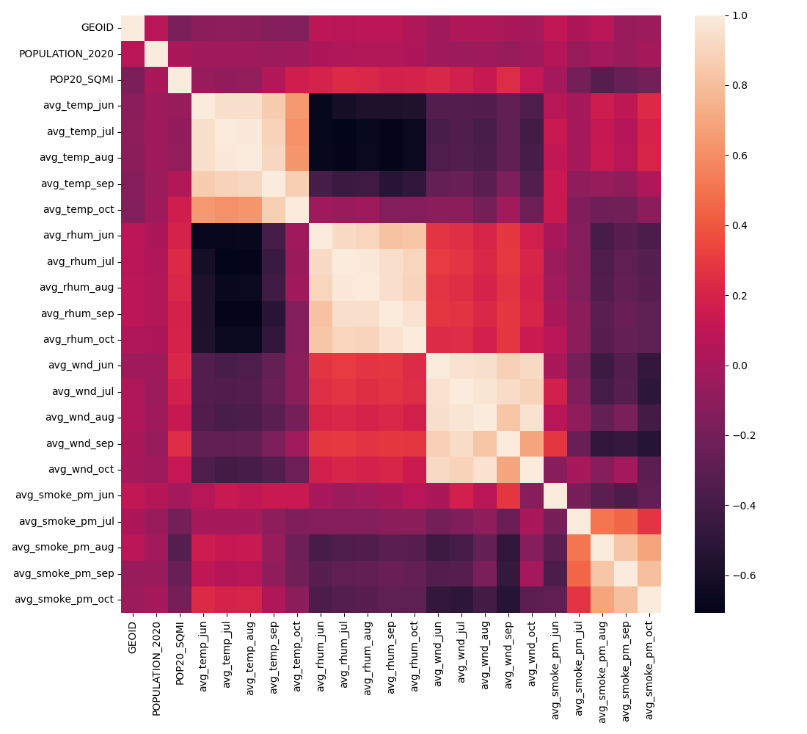

# Overview

| Properties             | Value                                                                                                                                                                                                                                                                                                 |
|:-----------------------|:------------------------------------------------------------------------------------------------------------------------------------------------------------------------------------------------------------------------------------------------------------------------------------------------------|
| Description            | This dataset includes information about the average weather and climate conditions during the summer months of 2020. It covers factors like temperature, wildfire smoke, wind speed, and relative humidity, sourced from PRISM and NOAA, and population density aggregated at the census tract level. |
| Spatial Coverage       | California                                                                                                                                                                                                                                                                                            |
| Spatial Resolution     | census tract                                                                                                                                                                                                                                                                                          |
| Temporal Coverage      | 2020                                                                                                                                                                                                                                                                                                  |
| Temporal Resolution    | annual                                                                                                                                                                                                                                                                                                |
| Original Data Sources  | https://prism.oregonstate.edu and https://www.ncei.noaa.gov/access/monitoring/wind/                                                                                                                                                                                                                   |
| Data Processing Code   | `notebooks/104_climate_exposure.ipynb`                                                                                                                                                                                                                                                                |
| Data Location          | https://drive.google.com/drive/folders/1De4e2DJhP1gzL5r-l9dXw4Jpa48imDH5?usp=sharing                                                                                                                                                                                                                  |
| Number of Variables    | 23                                                                                                                                                                                                                                                                                                    |
| Number of Observations | 8673                                                                                                                                                                                                                                                                                                  |
| Missing Cells          | 0                                                                                                                                                                                                                                                                                                     |
| Missing cells (%)      | 0.0%                                                                                                                                                                                                                                                                                                  |
| Duplicate Rows         | 0                                                                                                                                                                                                                                                                                                     |
| Duplicate Rows (%)     | 0.0%                                                                                                                                                                                                                                                                                                  |
| Total Size In Memory   | 1.52 MB                                                                                                                                                                                                                                                                                               |

# Variables

| Variable Name | Description |
| ------------- | ----------- |
| `GEOID` | Unique geographic identifier of the area. |
| `POPULATION_2020` | Total population of the area in 2020. |
| `POP20_SQMI` | Population density per square mile in 2020. |
| `avg_temp_jun` | Average temperature in the area for the month of June. |
| `avg_temp_jul` | Average temperature in the area for the month of July. |
| `avg_temp_aug` | Average temperature in the area for the month of August. |
| `avg_temp_sep` | Average temperature in the area for the month of September. |
| `avg_temp_oct` | Average temperature in the area for the month of October. |
| `avg_rhum_jun` | Average relative humidity in the area for the month of June. |
| `avg_rhum_jul` | Average relative humidity in the area for the month of July. |
| `avg_rhum_aug` | Average relative humidity in the area for the month of August. |
| `avg_rhum_sep` | Average relative humidity in the area for the month of September. |
| `avg_rhum_oct` | Average relative humidity in the area for the month of October. |
| `avg_wnd_jun` | Average wind speed in the area for the month of June. |
| `avg_wnd_jul` | Average wind speed in the area for the month of July. |
| `avg_wnd_aug` | Average wind speed in the area for the month of August. |
| `avg_wnd_sep` | Average wind speed in the area for the month of September. |
| `avg_wnd_oct` | Average wind speed in the area for the month of October. |
| `avg_smoke_pm_jun` | Average particulate matter from smoke in the area for the month of June. |
| `avg_smoke_pm_jul` | Average particulate matter from smoke in the area for the month of July. |
| `avg_smoke_pm_aug` | Average particulate matter from smoke in the area for the month of August. |
| `avg_smoke_pm_sep` | Average particulate matter from smoke in the area for the month of September. |
| `avg_smoke_pm_oct` | Average particulate matter from smoke in the area for the month of October. |

# Correlations

# Sample

|      GEOID |   POPULATION_2020 |   POP20_SQMI |   avg_temp_jun |   avg_temp_jul |   avg_temp_aug |   avg_temp_sep |   avg_temp_oct |   avg_rhum_jun |   avg_rhum_jul |   avg_rhum_aug |   avg_rhum_sep |   avg_rhum_oct |   avg_wnd_jun |   avg_wnd_jul |   avg_wnd_aug |   avg_wnd_sep |   avg_wnd_oct |   avg_smoke_pm_jun |   avg_smoke_pm_jul |   avg_smoke_pm_aug |   avg_smoke_pm_sep |   avg_smoke_pm_oct |
|-----------:|------------------:|-------------:|---------------:|---------------:|---------------:|---------------:|---------------:|---------------:|---------------:|---------------:|---------------:|---------------:|--------------:|--------------:|--------------:|--------------:|--------------:|-------------------:|-------------------:|-------------------:|-------------------:|-------------------:|
| 6.0014e+09 |              3038 |       1133.6 |          17.95 |        17.8629 |        20.8903 |        21.33   |        20.4871 |        78.0967 |        84.3613 |        77.3323 |        71.41   |        55.3065 |       6.95934 |       6.01075 |       5.44557 |       4.54262 |       5.98468 |                  0 |           0.133076 |            6.6703  |            25.2394 |            5.94424 |
| 6.0014e+09 |              2001 |       8700   |          17.95 |        17.65   |        19.579  |        21.0133 |        20.1258 |        79.64   |        84.2    |        80.3677 |        74.6667 |        62.9    |       6.95934 |       6.01075 |       5.44557 |       4.54262 |       5.98468 |                  0 |           0.14501  |            6.92154 |            25.341  |            6.17948 |
| 6.0014e+09 |              5504 |      12800   |          17.95 |        17.65   |        19.579  |        21.0133 |        20.1258 |        79.64   |        84.2    |        80.3677 |        74.6667 |        62.9    |       6.95934 |       6.01075 |       5.44557 |       4.54262 |       5.98468 |                  0 |           0.14501  |            6.92154 |            25.341  |            6.17948 |
| 6.0014e+09 |              4112 |      14685.7 |          17.95 |        17.65   |        19.579  |        21.0133 |        20.1258 |        79.64   |        84.2    |        80.3677 |        74.6667 |        62.9    |       6.95934 |       6.01075 |       5.44557 |       4.54262 |       5.98468 |                  0 |           0.14501  |            6.92154 |            25.341  |            6.17948 |
| 6.0014e+09 |              3644 |      15843.5 |          17.95 |        17.65   |        19.579  |        21.0133 |        20.1258 |        79.64   |        84.2    |        80.3677 |        74.6667 |        62.9    |       6.95934 |       6.01075 |       5.44557 |       4.54262 |       5.98468 |                  0 |           0.14501  |            6.92154 |            25.341  |            6.17948 |

Generated with `notebooks/201_make_data_dict.ipynb`.
