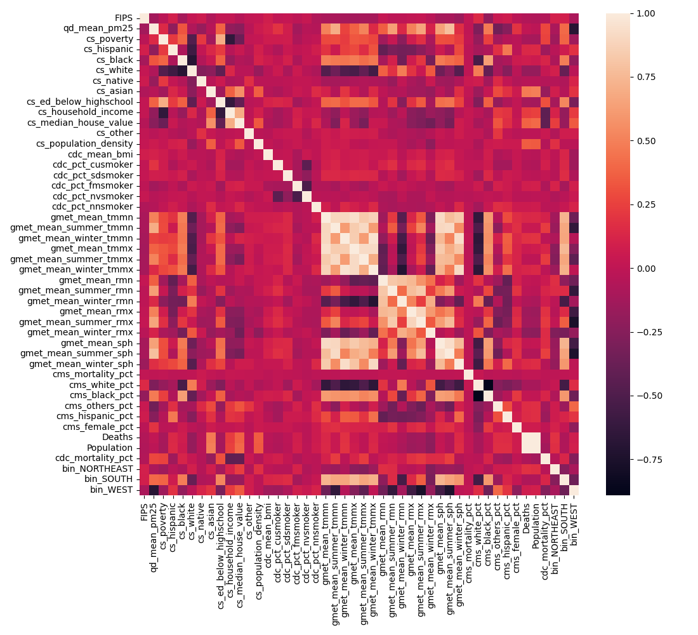

# Overview

| Properties             | Value                                                                                                                                                                                                                    |
|:-----------------------|:-------------------------------------------------------------------------------------------------------------------------------------------------------------------------------------------------------------------------|
| Description            | The dataset incorporates all-cause mortality data sourced from the CDC, along with a range of demographic and environmental variables, including data on temperature and air pollution, all pertaining to the year 2010. |
| Spatial Coverage       | Continental USA                                                                                                                                                                                                          |
| Spatial Resolution     | county                                                                                                                                                                                                                   |
| Temporal Coverage      | 2010                                                                                                                                                                                                                     |
| Temporal Resolution    | annual                                                                                                                                                                                                                   |
| Original Data Sources  | https://dataverse.harvard.edu/dataset.xhtml?persistentId=doi:10.7910/DVN/L7YF2G and https://wonder.cdc.gov/controller/datarequest/D77                                                                                    |
| Data Processing Code   | `notebooks/103_air_pollution.ipynb`                                                                                                                                                                                      |
| Data Location          | https://dataverse.harvard.edu/dataset.xhtml?persistentId=doi:10.7910/DVN/SYNPBS                                                                                                                                          |
| Number of Variables    | 48                                                                                                                                                                                                                       |
| Number of Observations | 3109                                                                                                                                                                                                                     |
| Missing Cells          | 141                                                                                                                                                                                                                      |
| Missing cells (%)      | 4.54%                                                                                                                                                                                                                    |
| Duplicate Rows         | 0                                                                                                                                                                                                                        |
| Duplicate Rows (%)     | 0.0%                                                                                                                                                                                                                     |
| Total Size In Memory   | 1.49 MB                                                                                                                                                                                                                  |

# Variables

| Variable Name | Description |
| ------------- | ----------- |
| `qd_mean_pm25` | Mean PM2.5 air pollution level. PM2.5 refers to atmospheric particulate matter with a diameter of less than 2.5 micrometers. |
| `cs_poverty` | Count or percentage of individuals living in poverty. |
| `cs_hispanic` | Population count identifying as Hispanic. |
| `cs_black` | Population count identifying as Black. |
| `cs_white` | Population count identifying as White. |
| `cs_native` | Population count identifying as Native American. |
| `cs_asian` | Population count identifying as Asian. |
| `cs_ed_below_highschool` | Population count with an educational attainment level below high school. |
| `cs_household_income` | Average household income in the area. |
| `cs_median_house_value` | Median value of houses in the area. |
| `cs_other` | Population count identifying as other than the specified races. |
| `cs_population_density` | Population density in the area (population per square mile). |
| `cdc_mean_bmi` | Mean body mass index (BMI) as recorded by the Centers for Disease Control and Prevention. |
| `cdc_pct_cusmoker` | Percentage of current smokers as recorded by the CDC. |
| `cdc_pct_sdsmoker` | Percentage of individuals who smoke some days as recorded by the CDC. |
| `cdc_pct_fmsmoker` | Percentage of individuals who smoke every day as recorded by the CDC. |
| `cdc_pct_nvsmoker` | Percentage of individuals who never smoked as recorded by the CDC. |
| `cdc_pct_nnsmoker` | Percentage of individuals who do not smoke now as recorded by the CDC. |
| `gmet_mean_tmmn` | Mean minimum temperature as recorded by Global Meteorological data. |
| `gmet_mean_summer_tmmn` | Mean minimum temperature during summer as recorded by Global Meteorological data. |
| `gmet_mean_winter_tmmn` | Mean minimum temperature during winter as recorded by Global Meteorological data. |
| `gmet_mean_tmmx` | Mean maximum temperature as recorded by Global Meteorological data. |
| `gmet_mean_summer_tmmx` | Mean maximum temperature during summer as recorded by Global Meteorological data. |
| `gmet_mean_winter_tmmx` | Mean maximum temperature during winter as recorded by Global Meteorological data. |
| `gmet_mean_rmn` | Mean minimum rainfall as recorded by Global Meteorological data. |
| `gmet_mean_summer_rmn` | Mean minimum rainfall during summer as recorded by Global Meteorological data. |
| `gmet_mean_winter_rmn` | Mean minimum rainfall during winter as recorded by Global Meteorological data. |
| `gmet_mean_rmx` | Mean maximum rainfall as recorded by Global Meteorological data. |
| `gmet_mean_summer_rmx` | Mean maximum rainfall during summer as recorded by Global Meteorological data. |
| `gmet_mean_winter_rmx` | Mean maximum rainfall during winter as recorded by Global Meteorological data. |
| `gmet_mean_sph` | Mean specific humidity as recorded by Global Meteorological data. |
| `gmet_mean_summer_sph` | Mean specific humidity during summer as recorded by Global Meteorological data. |
| `gmet_mean_winter_sph` | Mean specific humidity during winter as recorded by Global Meteorological data. |
| `cms_mortality_pct` | Percentage of mortality as recorded by the Centers for Medicare & Medicaid Services. |
| `cms_white_pct` | Percentage of white individuals as recorded by the Centers for Medicare & Medicaid Services. |
| `cms_black_pct` | Percentage of black individuals as recorded by the Centers for Medicare & Medicaid Services. |
| `cms_others_pct` | Percentage of individuals identifying as other races as recorded by the Centers for Medicare & Medicaid Services. |
| `cms_hispanic_pct` | Percentage of individuals identifying as Hispanic as recorded by the Centers for Medicare & Medicaid Services. |
| `cms_female_pct` | Percentage of female individuals as recorded by the Centers for Medicare & Medicaid Services. |
| `Notes` | Additional notes or comments related to the data. |
| `County` | Name of the county. |
| `Deaths` | Total number of deaths in the area as recorded by the CDC. |
| `Population` | Total population of the area. |
| `Crude Rate` | Crude death rate in the area. |
| `cdc_mortality_pct` | Percentage of deaths as recorded by the Centers for Disease Control and Prevention. |
| `bin_NORTHEAST` | Binary variable indicating whether the location is in the Northeast region of the United States. |
| `bin_SOUTH` | Binary variable indicating whether the location is in the Southern region of the United States. |
| `bin_WEST` | Binary variable indicating whether the location is in the Western region of the United States. |

# Correlations

# Sample

|   FIPS |   qd_mean_pm25 |   cs_poverty |   cs_hispanic |   cs_black |   cs_white |   cs_native |   cs_asian |   cs_ed_below_highschool |   cs_household_income |   cs_median_house_value |   cs_other |   cs_population_density |   cdc_mean_bmi |   cdc_pct_cusmoker |   cdc_pct_sdsmoker |   cdc_pct_fmsmoker |   cdc_pct_nvsmoker |   cdc_pct_nnsmoker |   gmet_mean_tmmn |   gmet_mean_summer_tmmn |   gmet_mean_winter_tmmn |   gmet_mean_tmmx |   gmet_mean_summer_tmmx |   gmet_mean_winter_tmmx |   gmet_mean_rmn |   gmet_mean_summer_rmn |   gmet_mean_winter_rmn |   gmet_mean_rmx |   gmet_mean_summer_rmx |   gmet_mean_winter_rmx |   gmet_mean_sph |   gmet_mean_summer_sph |   gmet_mean_winter_sph |   cms_mortality_pct |   cms_white_pct |   cms_black_pct |   cms_others_pct |   cms_hispanic_pct |   cms_female_pct | County             |   Deaths |   Population |   Crude Rate |   cdc_mortality_pct |   bin_NORTHEAST |   bin_SOUTH |   bin_WEST |
|-------:|---------------:|-------------:|--------------:|-----------:|-----------:|------------:|-----------:|-------------------------:|----------------------:|------------------------:|-----------:|------------------------:|---------------:|-------------------:|-------------------:|-------------------:|-------------------:|-------------------:|-----------------:|------------------------:|------------------------:|-----------------:|------------------------:|------------------------:|----------------:|-----------------------:|-----------------------:|----------------:|-----------------------:|-----------------------:|----------------:|-----------------------:|-----------------------:|--------------------:|----------------:|----------------:|-----------------:|-------------------:|-----------------:|:-------------------|---------:|-------------:|-------------:|--------------------:|----------------:|------------:|-----------:|
|   1001 |        11.8556 |    0.0858086 |    0.00280528 |  0.132013  |   0.852475 |  0.00874587 | 0.00264026 |                 0.2533   |                 37351 |                  133900 | 0.00132013 |                 89.4209 |        3208.39 |          0.146341  |          0.0243902 |           0.243902 |           0.560976 |          0.0243902 |          283.863 |                 295.446 |                 273.041 |          297.262 |                 307.294 |                 284.525 |         40.4298 |                45.2537 |                43.9528 |         88.9721 |                95.9595 |                85.7228 |      0.00941711 |              0.0167348 |             0.00400174 |          0          |        0.59589  |        0.40411  |       0          |                  0 |         0.554795 | Autauga County, AL |      148 |         6546 |       2260.9 |             22.6092 |               0 |           1 |          0 |
|   1003 |        10.4379 |    0.0533287 |    0.0140393  |  0.051535  |   0.918627 |  0.00541566 | 0.00224215 |                 0.160952 |                 40104 |                  177200 | 0.00814074 |                110.575  |        3249.75 |          0.147059  |          0.0392157 |           0.245098 |           0.568627 |          0         |          285.874 |                 296.672 |                 275.402 |          298.158 |                 306.452 |                 287.357 |         42.3423 |                50.0248 |                43.4265 |         90.2833 |                95.1494 |                88.1623 |      0.0102607  |              0.017282  |             0.00478393 |          0.0227273  |        0.63843  |        0.353306 |       0.00826446 |                  0 |         0.539256 | Baldwin County, AL |      640 |        30568 |       2093.7 |             20.9369 |               0 |           1 |          0 |
|   1005 |        11.5042 |    0.19443   |    0.00945875 |  0.333421  |   0.656069 |  0          | 0          |                 0.40515  |                 22143 |                   88200 | 0.00105097 |                 31.3027 |        2953.69 |          0.0714047 |          0.050425  |           0.216834 |           0.564502 |          0.0111988 |          284.135 |                 295.378 |                 273.83  |          297.649 |                 307.03  |                 285.585 |         40.0521 |                46.0208 |                43.7785 |         90.7641 |                96.7203 |                86.7272 |      0.00970464 |              0.0169258 |             0.00434312 |          0          |        0.690141 |        0.28169  |       0.028169   |                  0 |         0.507042 | Barbour County, AL |      102 |         3909 |       2609.4 |             26.0936 |               0 |           1 |          0 |
|   1007 |        11.8869 |    0.113087  |    0.00106686 |  0.121977  |   0.866287 |  0          | 0          |                 0.388691 |                 24875 |                   81200 | 0.0106686  |                 36.3165 |        3255.29 |          0.103448  |          0.0229885 |           0.310345 |           0.551724 |          0.0114943 |          283.539 |                 295.315 |                 272.578 |          296.797 |                 307.042 |                 283.907 |         41.5986 |                47.2497 |                43.8774 |         89.5762 |                96.4847 |                85.8461 |      0.00939423 |              0.0169568 |             0.00383068 |          0.0215264  |        0.655577 |        0.340509 |       0.00391389 |                  0 |         0.571429 | Bibb County, AL    |       73 |         2906 |       2512   |             25.1204 |               0 |           1 |          0 |
|   1009 |        11.6592 |    0.104793  |    0.0094363  |  0.0105538 |   0.968463 |  0.00583561 | 0          |                 0.359449 |                 25857 |                  113700 | 0.00571145 |                 87.9251 |        3500.33 |          0.0833333 |          0         |           0.25     |           0.638889 |          0.0277778 |          282.61  |                 294.704 |                 271.343 |          295.556 |                 306.452 |                 281.915 |         42.4458 |                48.2832 |                46.0712 |         88.7252 |                96.3753 |                84.9593 |      0.00895414 |              0.0165894 |             0.0035027  |          0.00621118 |        0.701863 |        0.298137 |       0          |                  0 |         0.608696 | Blount County, AL  |      202 |         8439 |       2393.6 |             23.9365 |               0 |           1 |          0 |

Generated with `notebooks/201_make_data_dict.ipynb`.
