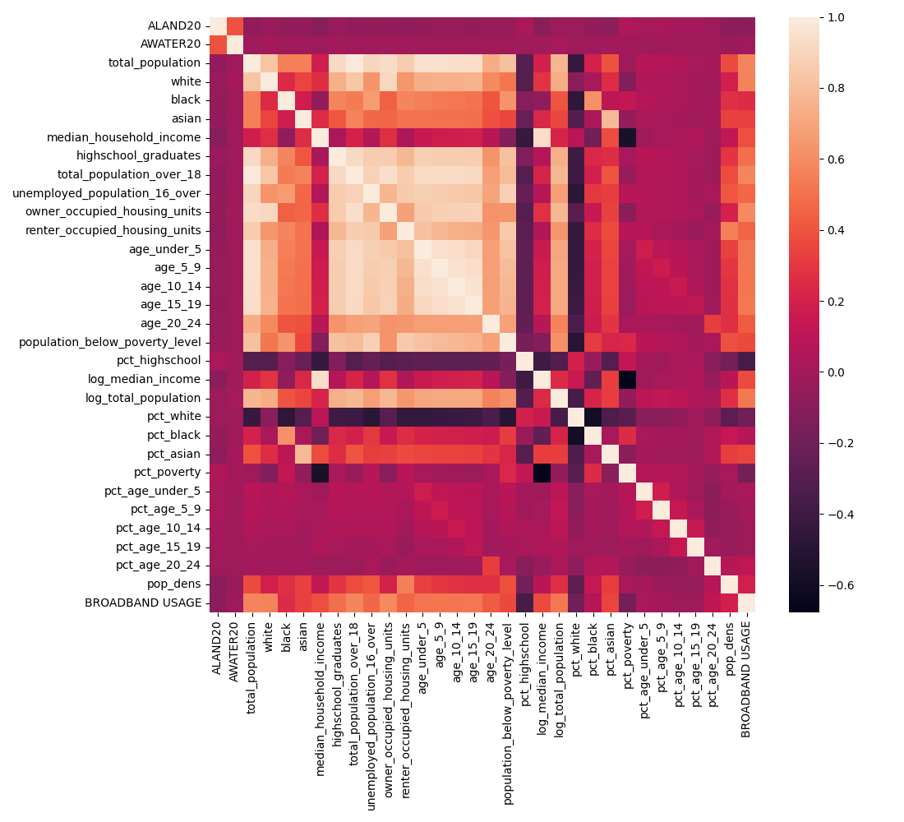

# Overview

| Properties             | Value                                                                                                                                                                                                                                                                                                                                 |
|:-----------------------|:--------------------------------------------------------------------------------------------------------------------------------------------------------------------------------------------------------------------------------------------------------------------------------------------------------------------------------------|
| Description            | This data contains broadband usage information at the ZCTA (zipcode) level from Microsoft's [USBroadband Dataset](https://github.com/microsoft/USBroadbandUsagePercentages) at the zip code (ZCTA) level for the year 2020. Data from the 2020 Census is used to provide demographic and socioeconomic information at the ZCTA level. |
| Spatial Coverage       | US                                                                                                                                                                                                                                                                                                                                    |
| Spatial Resolution     | zcta                                                                                                                                                                                                                                                                                                                                  |
| Temporal Coverage      | 2020                                                                                                                                                                                                                                                                                                                                  |
| Temporal Resolution    | annual                                                                                                                                                                                                                                                                                                                                |
| Original Data Sources  | ['https://github.com/microsoft/USBroadbandUsagePercentages', 'https://www.census.gov/']                                                                                                                                                                                                                                               |
| Data Processing Code   | notebooks/105_broadband.ipynb                                                                                                                                                                                                                                                                                                         |
| Data Location          | https://dataverse.harvard.edu/dataset.xhtml?persistentId=doi:10.7910/DVN/SYNPBS                                                                                                                                                                                                                                                       |
| Number of Variables    | 32                                                                                                                                                                                                                                                                                                                                    |
| Number of Observations | 32595                                                                                                                                                                                                                                                                                                                                 |
| Missing Cells          | 2133                                                                                                                                                                                                                                                                                                                                  |
| Missing cells (%)      | 6.54%                                                                                                                                                                                                                                                                                                                                 |
| Duplicate Rows         | 82                                                                                                                                                                                                                                                                                                                                    |
| Duplicate Rows (%)     | 0.25157232704402516%                                                                                                                                                                                                                                                                                                                  |
| Total Size In Memory   | 9.89 MB                                                                                                                                                                                                                                                                                                                               |

# Variables

| Variable Name | Description |
| ------------- | ----------- |
| `ALAND20` | Land area (square meters) (TIGERLINE) |
| `AWATER20` | Water area (square meters) (TIGERLINE) |
| `total_population` | Total population (Census) |
| `white` | White population  (Census) |
| `median_household_income` | Median household income (Census) |
| `highschool_graduates` | High school graduates (Census) |
| `total_population_over_18` | Total population over 18 (Census) |
| `unemployed_population_16_over` | Unemployed population over 16 (Census) |
| `owner_occupied_housing_units` | Owner occupied housing units (Census) |
| `renter_occupied_housing_units` | Renter occupied housing units (Census) |
| `age_under_5` | Population under 5 (Census) |
| `age_5_9` | Population 5-9 (Census) |
| `age_10_14` | Population 10-14 (Census) |
| `age_15_19` | Population 15-19 (Census) |
| `age_20_24` | Population 20-24 (Census) |
| `population_below_poverty_level` | Population below poverty level (Census) |
| `pct_highschool_graduates` | Percent high school graduates (Census, Processed) |
| `log_median_income` | Log median income (Census, Processed) |
| `log_total_population` | Log total population (Census, Processed) |
| `pct_white` | Percent white (Census, Processed) |
| `pct_black` | Percent black (Census, Processed) |
| `pct_asian` | Percent asian (Census, Processed) |
| `pct_poverty` | Percent below poverty level (Census, Processed) |
| `pct_age_under_5` | Percent population under 5 (Census, Processed) |
| `pct_age_5_9` | Percent population 5-9 (Census, Processed) |
| `pct_age_10_14` | Percent population 10-14 (Census, Processed) |
| `pct_age_15_19` | Percent population 15-19 (Census, Processed) |
| `pct_age_20_24` | Percent population 20-24 (Census, Processed) |
| `pop_dens` | Population density (Census, Processed) |
| `BROADBAND USAGE PERCENTAGE` | Broadband usage percentage (Microsoft) |

# Correlations

# Sample

|     ALAND20 |         AWATER20 |   total_population |   white |   black |   asian |   median_household_income |   highschool_graduates |   total_population_over_18 |   unemployed_population_16_over |   owner_occupied_housing_units |   renter_occupied_housing_units |   age_under_5 |   age_5_9 |   age_10_14 |   age_15_19 |   age_20_24 |   population_below_poverty_level |   pct_highschool |   log_median_income |   log_total_population |   pct_white |   pct_black |   pct_asian |   pct_poverty |   pct_age_under_5 |   pct_age_5_9 |   pct_age_10_14 |   pct_age_15_19 |   pct_age_20_24 |   pop_dens |   BROADBAND USAGE |
|------------:|-----------------:|-------------------:|--------:|--------:|--------:|--------------------------:|-----------------------:|---------------------------:|--------------------------------:|-------------------------------:|--------------------------------:|--------------:|----------:|------------:|------------:|------------:|---------------------------------:|-----------------:|--------------------:|-----------------------:|------------:|------------:|------------:|--------------:|------------------:|--------------:|----------------:|----------------:|----------------:|-----------:|------------------:|
| 2.92474e+07 |      2.12789e+06 |              16064 |   13967 |     387 |     509 |                     66088 |                   3245 |                      12379 |                             362 |                           5053 |                            1818 |           463 |       358 |         545 |         266 |          92 |                             1301 |        0.262137  |             11.0987 |                9.68434 |    0.86946  |  0.0240911  |  0.0316858  |    0.0809885  |        0.0288222  |     0.0222859 |       0.0339268 |      0.0165588  |      0.00572709 |   54.9245  |             0.808 |
| 1.37932e+08 |      4.28097e+06 |              30099 |   21114 |    1658 |    3101 |                     60540 |                   1562 |                      14177 |                            1305 |                           5054 |                            5128 |           470 |       489 |         563 |         416 |        1364 |                             5920 |        0.110178  |             11.0111 |               10.3122  |    0.701485 |  0.0550849  |  0.103027   |    0.196684   |        0.0156151  |     0.0162464 |       0.0187049 |      0.0138211  |      0.0453171  |   21.8216  |             0.638 |
| 2.08267e+06 |  14001           |              11588 |    7363 |     481 |    2377 |                       nan |                      6 |                         74 |                             948 |                              4 |                              19 |             0 |         0 |           0 |          63 |        3077 |                               24 |        0.0810811 |            nan      |                9.35773 |    0.635399 |  0.0415085  |  0.205126   |    0.00207111 |        0          |     0         |       0         |      0.00543666 |      0.265533   |  556.401   |             1     |
| 1.11859e+08 | 666424           |               5166 |    4833 |     103 |      17 |                     80060 |                   1087 |                       3578 |                             114 |                           1743 |                             140 |            35 |        66 |         173 |         111 |          63 |                              554 |        0.303801  |             11.2905 |                8.54985 |    0.93554  |  0.0199381  |  0.00329075 |    0.10724    |        0.00677507 |     0.0127758 |       0.0334882 |      0.0214866  |      0.0121951  |    4.61831 |             0.28  |
| 1.42111e+08 |      6.93647e+06 |              15080 |   13612 |     112 |     529 |                     94812 |                   2282 |                      10584 |                             316 |                           4685 |                             982 |           447 |       382 |         609 |         390 |         261 |                              747 |        0.215608  |             11.4597 |                9.62112 |    0.902653 |  0.00742706 |  0.0350796  |    0.0495358  |        0.0296419  |     0.0253316 |       0.0403846 |      0.0258621  |      0.0173077  |   10.6114  |             0.496 |

Generated with `notebooks/201_make_data_dict.ipynb`.
