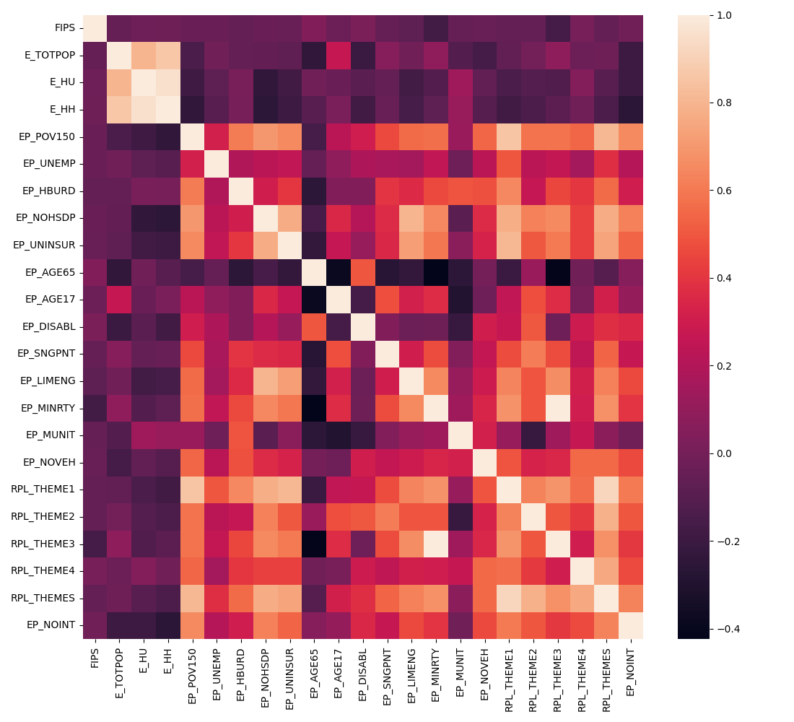

# Overview

| Properties             | Value                                                                                                                                                                                                                                                                 |
|:-----------------------|:----------------------------------------------------------------------------------------------------------------------------------------------------------------------------------------------------------------------------------------------------------------------|
| Description            | A subset of the Social Vulnerability Index data provided by the CDC/ATSDR.  The index represents the potential adverse impacts on communities due to  external strains on human health, such as natural disasters, human-induced  catastrophes, or disease outbreaks. |
| Spatial Coverage       | Texas                                                                                                                                                                                                                                                                 |
| Spatial Resolution     | census tract                                                                                                                                                                                                                                                          |
| Temporal Coverage      | 2020                                                                                                                                                                                                                                                                  |
| Temporal Resolution    | annual                                                                                                                                                                                                                                                                |
| Original Data Sources  | https://www.atsdr.cdc.gov/placeandhealth/svi/data_documentation_download.html                                                                                                                                                                                         |
| Data Processing Code   | notebooks/102_cdc_atsdr_svi.ipynb                                                                                                                                                                                                                                     |
| Data Location          | https://dataverse.harvard.edu/dataset.xhtml?persistentId=doi:10.7910/DVN/SYNPBS                                                                                                                                                                                       |
| Number of Variables    | 23                                                                                                                                                                                                                                                                    |
| Number of Observations | 6828                                                                                                                                                                                                                                                                  |
| Missing Cells          | 0                                                                                                                                                                                                                                                                     |
| Missing cells (%)      | 0.0%                                                                                                                                                                                                                                                                  |
| Duplicate Rows         | 0                                                                                                                                                                                                                                                                     |
| Duplicate Rows (%)     | 0.0%                                                                                                                                                                                                                                                                  |
| Total Size In Memory   | 1.2 MB                                                                                                                                                                                                                                                                |

# Variables

| Variable Name | Description |
| ------------- | ----------- |
| `FIPS` | Federal Information Processing Standard state code. This is a unique  identifier for geographic regions in the United States, often used in data  collection and analysis. |
| `E_TOTPOP` | The estimated total population of the geographical region. |
| `E_HU` | The estimated total number of housing units in the area. |
| `E_HH` | The estimated number of households in the area. |
| `EP_MUNIT` | The estimated percentage of housing units in a multi-unit structure. |
| `EP_NOINT` | The estimated percentage of households without an internet subscription. |
| `EP_POV150` | The estimated percentage of the population living at 150% of the poverty level or below. |
| `EP_UNEMP` | The estimated percentage of the labor force that is unemployed. |
| `EP_HBURD` | The estimated percentage of households with housing cost burdens  (defined as spending more than 30% of income on housing). |
| `EP_NOHSDP` | The estimated percentage of the population aged 25 or older without a  high school diploma or equivalent. |
| `EP_UNINSUR` | The estimated percentage of the population without health insurance. |
| `EP_AGE65` | The estimated percentage of the population aged 65 or older. |
| `EP_AGE17` | The estimated percentage of the population aged 17 or younger. |
| `EP_DISABL` | The estimated percentage of the population with a disability. |
| `EP_SNGPNT` | The estimated percentage of single-parent households. |
| `EP_LIMENG` | The estimated percentage of the population with limited English proficiency. |
| `EP_MINRTY` | The estimated percentage of the population identified as a racial or ethnic minority. |
| `EP_NOVEH` | The estimated percentage of households with no vehicle available. |
| `RPL_THEME1` | Percentile ranking for Socioeconomic Status theme summary. |
| `RPL_THEME2` | Percentile ranking for Household Characteristics theme summary. |
| `RPL_THEME3` | Percentile ranking for Racial and Ethnic Minority Status theme. |
| `RPL_THEME4` | Percentile ranking for Housing Type/ Transportation theme. |
| `RPL_THEMES` | Overall percentile ranking. |

# Correlations

# Sample

|       FIPS |   E_TOTPOP |   E_HU |   E_HH |   EP_POV150 |   EP_UNEMP |   EP_HBURD |   EP_NOHSDP |   EP_UNINSUR |   EP_AGE65 |   EP_AGE17 |   EP_DISABL |   EP_SNGPNT |   EP_LIMENG |   EP_MINRTY |   EP_MUNIT |   EP_NOVEH |   RPL_THEME1 |   RPL_THEME2 |   RPL_THEME3 |   RPL_THEME4 |   RPL_THEMES |   EP_NOINT |
|-----------:|-----------:|-------:|-------:|------------:|-----------:|-----------:|------------:|-------------:|-----------:|-----------:|------------:|------------:|------------:|------------:|-----------:|-----------:|-------------:|-------------:|-------------:|-------------:|-------------:|-----------:|
| 4.8002e+10 |       4958 |   2411 |   1779 |        24.7 |        8.2 |       19.3 |         8.7 |         11.3 |       18.6 |       26   |        20.6 |         9.2 |         1.3 |        23.1 |        1.8 |        2.2 |       0.45   |       0.828  |       0.1354 |       0.8482 |       0.6448 |       22.7 |
| 4.8002e+10 |       4867 |    100 |     81 |         0   |        0   |        8.6 |        26.9 |         12.7 |        1.9 |        2.4 |         0   |         8.6 |         1.4 |        69.2 |        0   |        0   |       0.1415 |       0.0265 |       0.6124 |       0.3242 |       0.1244 |        5.2 |
| 4.8002e+10 |       4397 |   1701 |   1394 |        30.6 |        4   |       25.3 |        14.2 |         13.5 |       15.7 |       29.3 |        10.7 |        12.5 |         5.9 |        60.2 |        7.6 |        5.9 |       0.5069 |       0.8672 |       0.5285 |       0.9126 |       0.7667 |       23.6 |
| 4.8002e+10 |       4704 |   2093 |   1622 |        40.6 |        3.5 |       24.9 |        27.2 |         17   |       17.4 |       22.9 |        14.8 |         5.4 |         0.6 |        37   |        3.3 |        8.1 |       0.6418 |       0.4335 |       0.2849 |       0.8012 |       0.6279 |       25.9 |
| 4.8002e+10 |       2497 |   1041 |    809 |        25.2 |        3.2 |       43.8 |        23.3 |         28.2 |       12.8 |       32.4 |        19.8 |        11.5 |         7.6 |        79.3 |        5.1 |        8.3 |       0.7482 |       0.9645 |       0.7063 |       0.9383 |       0.9363 |       31.1 |

Generated with `notebooks/201_make_data_dict.ipynb`.
