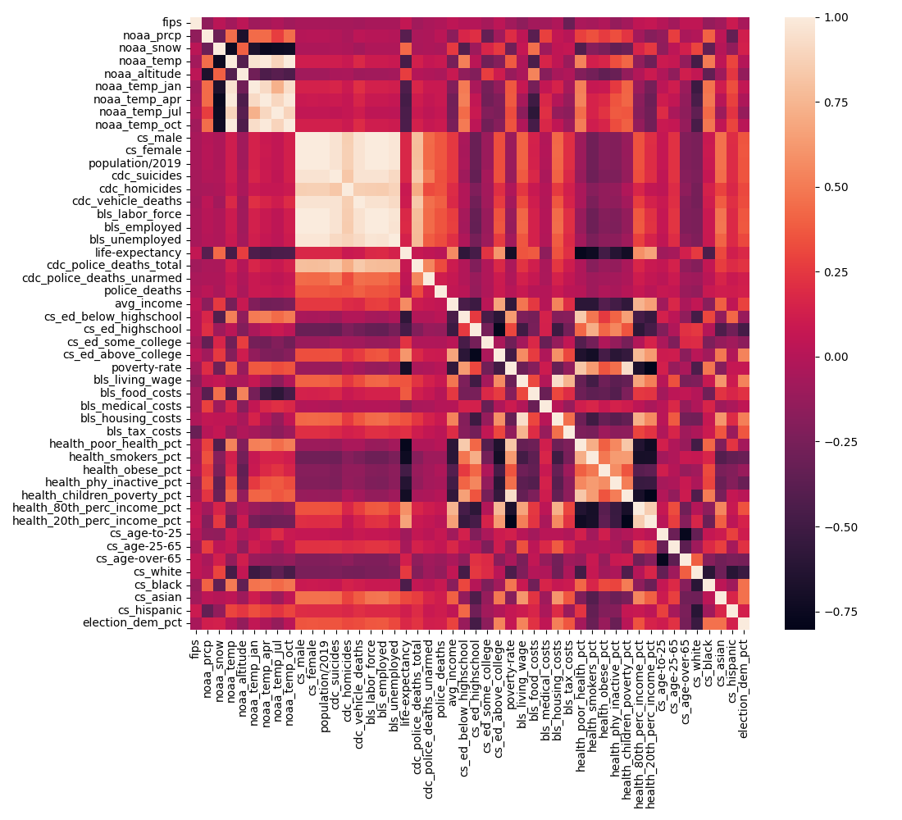

# Overview

| Properties             | Value                                                                                                                                                                                                                                                            |
|:-----------------------|:-----------------------------------------------------------------------------------------------------------------------------------------------------------------------------------------------------------------------------------------------------------------|
| Description            | The dataset includes election outcomes, specifically the percentage of the population in each county that voted for the Democratic Party in 2020. It also contains various aggregated data, such as demographics and  employment statistics, from 2019 and 2020. |
| Spatial Coverage       | Continental USA                                                                                                                                                                                                                                                  |
| Spatial Resolution     | county                                                                                                                                                                                                                                                           |
| Temporal Coverage      | 2019 and 2020                                                                                                                                                                                                                                                    |
| Temporal Resolution    | annual                                                                                                                                                                                                                                                           |
| Original Data Sources  | https://github.com/evangambit/JsonOfCounties                                                                                                                                                                                                                     |
| Data Processing Code   | `notebooks/101_election_data.ipynb`                                                                                                                                                                                                                              |
| Data Location          | https://dataverse.harvard.edu/dataset.xhtml?persistentId=doi:10.7910/DVN/SYNPBS                                                                                                                                                                                  |
| Number of Variables    | 48                                                                                                                                                                                                                                                               |
| Number of Observations | 3142                                                                                                                                                                                                                                                             |
| Missing Cells          | 985                                                                                                                                                                                                                                                              |
| Missing cells (%)      | 31.35%                                                                                                                                                                                                                                                           |
| Duplicate Rows         | 0                                                                                                                                                                                                                                                                |
| Duplicate Rows (%)     | 0.0%                                                                                                                                                                                                                                                             |
| Total Size In Memory   | 1.15 MB                                                                                                                                                                                                                                                          |

# Variables

| Variable Name | Description |
| ------------- | ----------- |
| `fips` | Federal Information Processing Standard code, a unique identifier for counties and county equivalents  in the United States. |
| `noaa_prcp` | Average precipitation recorded by the National Oceanic and Atmospheric Administration. |
| `noaa_snow` | Average snowfall recorded by the National Oceanic and Atmospheric Administration. |
| `noaa_temp` | Average temperature recorded by the National Oceanic and Atmospheric Administration. |
| `noaa_altitude` | Altitude of the location as recorded by the National Oceanic and Atmospheric Administration. |
| `noaa_temp_jan` | Average temperature in January as recorded by the National Oceanic and Atmospheric Administration. |
| `noaa_temp_apr` | Average temperature in April as recorded by the National Oceanic and Atmospheric Administration. |
| `noaa_temp_jul` | Average temperature in July as recorded by the National Oceanic and Atmospheric Administration. |
| `noaa_temp_oct` | Average temperature in October as recorded by the National Oceanic and Atmospheric Administration. |
| `cs_male` | Male population count. |
| `cs_female` | Female population count. |
| `population/2019` | Total population of the area in 2019. |
| `cdc_suicides` | Number of suicide cases as recorded by the Centers for Disease Control and Prevention. |
| `cdc_homicides` | Number of homicide cases as recorded by the Centers for Disease Control and Prevention. |
| `cdc_vehicle_deaths` | Number of vehicle-related death cases as recorded by the Centers for Disease Control and Prevention. |
| `bls_labor_force` | Total labor force count as recorded by the Bureau of Labor Statistics. |
| `bls_employed` | Number of employed people as recorded by the Bureau of Labor Statistics. |
| `bls_unemployed` | Number of unemployed people as recorded by the Bureau of Labor Statistics. |
| `life-expectancy` | Average life expectancy of individuals in the area. |
| `cdc_police_deaths_total` | Total number of deaths caused by police as recorded by the Centers for Disease Control and Prevention. |
| `cdc_police_deaths_unarmed` | Number of deaths of unarmed individuals caused by police as recorded by the Centers for Disease  Control and Prevention. |
| `police_deaths` | Total number of police deaths in the area. |
| `avg_income` | Average income of individuals in the area. |
| `cs_ed_below_highschool` | Population count with an educational attainment level below high school. |
| `cs_ed_highschool` | Population count with high school as their highest educational attainment level. |
| `cs_ed_some_college` | Population count with some college education but without a degree. |
| `cs_ed_above_college` | Population count with an educational attainment level above college. |
| `poverty-rate` | Poverty rate in the area. |
| `bls_living_wage` | Living wage as defined by the Bureau of Labor Statistics. |
| `bls_food_costs` | Average food cost as defined by the Bureau of Labor Statistics. |
| `bls_medical_costs` | Average medical cost as defined by the Bureau of Labor Statistics. |
| `bls_housing_costs` | Average housing cost as defined by the Bureau of Labor Statistics. |
| `bls_tax_costs` | Average tax cost as defined by the Bureau of Labor Statistics. |
| `health_poor_health_pct` | Percentage of population reporting poor health. |
| `health_smokers_pct` | Percentage of population that are smokers. |
| `health_obese_pct` | Percentage of population that are obese. |
| `health_phy_inactive_pct` | Percentage of population that are physically inactive. |
| `health_children_poverty_pct` | Percentage of children living in poverty. |
| `health_80th_perc_income_pct` | Income at the 80th percentile. |
| `health_20th_perc_income_pct` | Income at the 20th percentile. |
| `cs_age-to-25` | Population count under the age of 25. |
| `cs_age-25-65` | Population count between the ages of 25 and 65. |
| `cs_age-over-65` | Population count over the age of 65. |
| `cs_white` | Population count identifying as White. |
| `cs_black` | Population count identifying as Black. |
| `cs_asian` | Population count identifying as Asian. |
| `cs_hispanic` | Population count identifying as Hispanic. |
| `election_dem_pct` | Percentage of votes received by the Democratic party in the last election. |

# Correlations

# Sample

|   fips |   noaa_prcp |   noaa_snow |   noaa_temp |   noaa_altitude |   noaa_temp_jan |   noaa_temp_apr |   noaa_temp_jul |   noaa_temp_oct |   cs_male |   cs_female |   population/2019 |   cdc_suicides |   cdc_homicides |   cdc_vehicle_deaths |   bls_labor_force |   bls_employed |   bls_unemployed |   life-expectancy |   cdc_police_deaths_total |   cdc_police_deaths_unarmed |   police_deaths |   avg_income |   cs_ed_below_highschool |   cs_ed_highschool |   cs_ed_some_college |   cs_ed_above_college |   poverty-rate |   bls_living_wage |   bls_food_costs |   bls_medical_costs |   bls_housing_costs |   bls_tax_costs |   health_poor_health_pct |   health_smokers_pct |   health_obese_pct |   health_phy_inactive_pct |   health_children_poverty_pct |   health_80th_perc_income_pct |   health_20th_perc_income_pct |   cs_age-to-25 |   cs_age-25-65 |   cs_age-over-65 |   cs_white |   cs_black |   cs_asian |   cs_hispanic |   election_dem_pct |
|-------:|------------:|------------:|------------:|----------------:|----------------:|----------------:|----------------:|----------------:|----------:|------------:|------------------:|---------------:|----------------:|---------------------:|------------------:|---------------:|-----------------:|------------------:|--------------------------:|----------------------------:|----------------:|-------------:|-------------------------:|-------------------:|---------------------:|----------------------:|---------------:|------------------:|-----------------:|--------------------:|--------------------:|----------------:|-------------------------:|---------------------:|-------------------:|--------------------------:|------------------------------:|------------------------------:|------------------------------:|---------------:|---------------:|-----------------:|-----------:|-----------:|-----------:|--------------:|-------------------:|
|  31039 |        30.5 |        28.2 |        48.8 |           418.2 |            20.9 |            49   |            74.9 |            50.8 |      4435 |        4411 |              8846 |        0.47619 |       nan       |              1.95238 |              4830 |           4708 |              122 |             81.2  |                         0 |                           0 |               0 |        58610 |                     11.6 |               35.1 |                 29.5 |                  23.8 |            8.9 |             12.89 |             3246 |                2783 |                5460 |            5385 |                  14.5906 |              16.2698 |               39.2 |                      25.3 |                          10.4 |                        103361 |                         27300 |       0.321275 |       0.455121 |         0.223604 |   0.875763 | 0.00531314 | 0.00486095 |     0.103324  |            19.5462 |
|  31109 |        31   |        25.3 |        51   |           392.4 |            24.1 |            50.9 |            76.8 |            52.9 |    160211 |      158879 |            319090 |       33.381   |         5.28571 |             25.0476  |            177006 |         169507 |             7499 |             80.46 |                         0 |                           0 |               0 |        49889 |                      6.3 |               21.5 |                 32.6 |                  39.5 |           10.7 |             14.72 |             3246 |                2783 |                7452 |            7197 |                  12.5342 |              16.4308 |               29.8 |                      17.3 |                          10.6 |                        114731 |                         27068 |       0.374462 |       0.481685 |         0.143853 |   0.806309 | 0.0429127  | 0.0479583  |     0.0738569 |            52.7212 |
|  31129 |        27.7 |        22.2 |        51.5 |           521.2 |            25.6 |            51   |            77.1 |            52.8 |      2059 |        2089 |              4148 |      nan       |       nan       |              1.42857 |              2454 |           2388 |               66 |             80.12 |                         0 |                           0 |               0 |        50836 |                      8.1 |               34   |                 37   |                  20.9 |           11.2 |             12.89 |             3246 |                2783 |                5460 |            5385 |                  14.9405 |              18.2293 |               35.3 |                      31.3 |                          14.8 |                         88236 |                         20243 |       0.261813 |       0.466008 |         0.272179 |   0.937801 | 0.00313404 | 0.0135005  |     0.0303761 |            17.7594 |
|  31101 |        20   |        25   |        50   |           991.4 |            26.7 |            48.1 |            75.4 |            50.4 |      4052 |        3982 |              8034 |        1.38095 |       nan       |              2.09524 |              4547 |           4400 |              147 |             79.24 |                         0 |                           0 |               0 |        45896 |                      8.5 |               31.7 |                 39.3 |                  20.5 |           11.1 |             13.4  |             3246 |                2783 |                6312 |            5584 |                  14.6555 |              18.2972 |               32.4 |                      28.3 |                          17.8 |                         96476 |                         19538 |       0.266119 |       0.462908 |         0.270973 |   0.888723 | 0.0112024  | 0.00672143 |     0.0777944 |            17.484  |
|  31137 |        25.5 |        26.7 |        50.3 |           705.8 |            25.7 |            49.4 |            75   |            51.9 |      4527 |        4507 |              9034 |        1.09524 |       nan       |              1.95238 |              4953 |           4805 |              148 |             79.86 |                         0 |                           0 |               0 |        52792 |                      6.7 |               29.9 |                 39.9 |                  23.5 |           10   |             12.89 |             3246 |                2783 |                5460 |            5385 |                  13.3691 |              16.169  |               37.8 |                      25.7 |                          13.2 |                        104152 |                         27004 |       0.314147 |       0.474098 |         0.211756 |   0.917866 | 0.00387425 | 0.0046491  |     0.0583352 |            15.013  |

Generated with `notebooks/201_make_data_dict.ipynb`.
