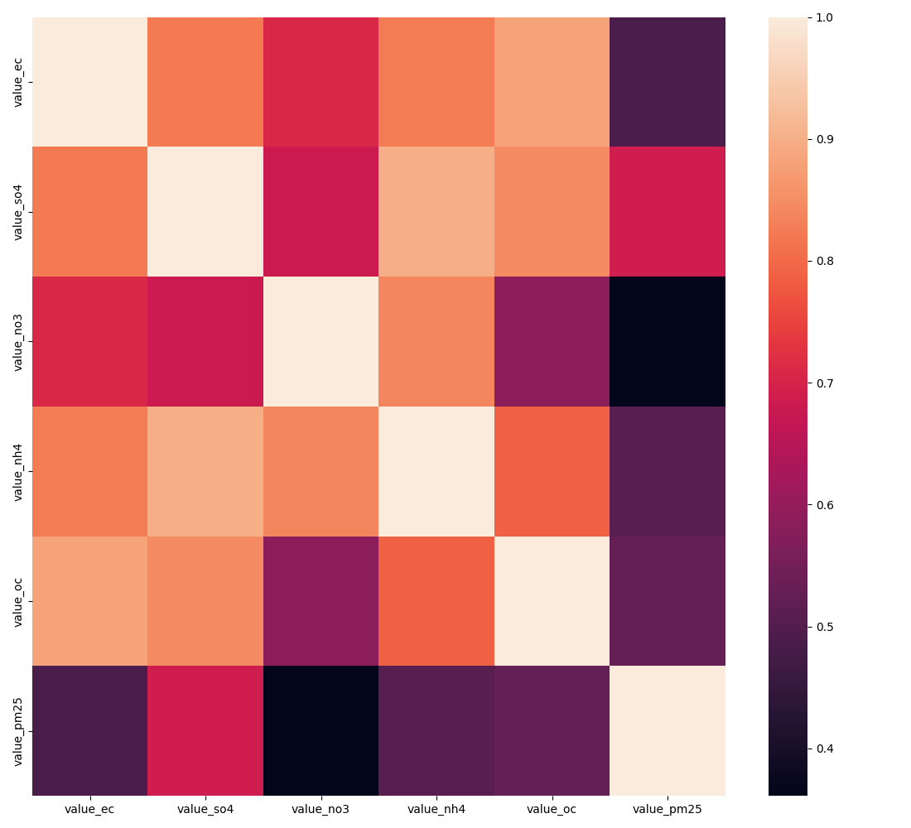

# Overview

| Properties             | Value                                                                                                                                                                                                                                                                                                                                                                                                                                                   |
|:-----------------------|:--------------------------------------------------------------------------------------------------------------------------------------------------------------------------------------------------------------------------------------------------------------------------------------------------------------------------------------------------------------------------------------------------------------------------------------------------------|
| Description            | The data is sourced at high spatial resolution of 1km x 1km.  After merging multiple sources and removing missing values, the dataset contains around 5,000,000 observations. This dataset contains estimates of PM2.5 and of PM2.5 components for the contiguous United States at 1km resolution.  The components are: EC (Elemental Carbon), NH4 (Ammonium), NO3 (Nitrate), OC (Organic Carbon), and SO4(Sulfate).  The values are for the 2000 year. |
| Spatial Coverage       | Contiguous USA                                                                                                                                                                                                                                                                                                                                                                                                                                          |
| Spatial Resolution     | 1km x 1km                                                                                                                                                                                                                                                                                                                                                                                                                                               |
| Temporal Coverage      | 2000                                                                                                                                                                                                                                                                                                                                                                                                                                                    |
| Temporal Resolution    | annual                                                                                                                                                                                                                                                                                                                                                                                                                                                  |
| Original Data Sources  | ['https://sedac.ciesin.columbia.edu/data/set/aqdh-pm2-5-component-ec-nh4-no3-oc-so4-50m-1km-contiguous-us-2000-2019/data-download', 'https://sedac.ciesin.columbia.edu/data/set/aqdh-pm2-5-annual-concentrations-1km-contiguous-us-2000-2019/data-download']                                                                                                                                                                                            |
| Data Processing Code   | notebooks/106_pm25comps.ipynb                                                                                                                                                                                                                                                                                                                                                                                                                           |
| Data Location          | https://dataverse.harvard.edu/dataset.xhtml?persistentId=doi:10.7910/DVN/SYNPBS                                                                                                                                                                                                                                                                                                                                                                         |
| Number of Variables    | 6                                                                                                                                                                                                                                                                                                                                                                                                                                                       |
| Number of Observations | 4170738                                                                                                                                                                                                                                                                                                                                                                                                                                                 |
| Missing Cells          | 0                                                                                                                                                                                                                                                                                                                                                                                                                                                       |
| Missing cells (%)      | 0.0%                                                                                                                                                                                                                                                                                                                                                                                                                                                    |
| Duplicate Rows         | 0                                                                                                                                                                                                                                                                                                                                                                                                                                                       |
| Duplicate Rows (%)     | 0.0%                                                                                                                                                                                                                                                                                                                                                                                                                                                    |
| Total Size In Memory   | 434.76 MB                                                                                                                                                                                                                                                                                                                                                                                                                                               |

# Variables

| Variable Name | Description |
| ------------- | ----------- |
| `value_pm25` | PM2.5 1km x 1km estimates |
| `value_ec` | Elemental Carbon 1km x 1km estimates |
| `value_so4` | Sulfate 1km x 1km estimates |
| `value_no3` | Nitrate 1km x 1km estimates |
| `value_nh4` | Ammonium 1km x 1km estimates |
| `value_oc` | Organic Carbon 1km x 1km estimates |

# Correlations

# Sample

|   value_ec |   value_so4 |   value_no3 |   value_nh4 |   value_oc |   value_pm25 |
|-----------:|------------:|------------:|------------:|-----------:|-------------:|
|   0.206392 |    0.86574  |    0.264086 |   0.165173  |   1.02372  |      5.05539 |
|   0.293871 |    0.828311 |    0.300283 |   0.0729348 |   1.5263   |      4.51217 |
|   0.207079 |    0.79575  |    0.288293 |   0.130885  |   1.11146  |      4.92364 |
|   0.147502 |    0.763437 |    0.21301  |   0.14376   |   0.939082 |      3.55784 |
|   0.126345 |    0.714855 |    0.196622 |   0.190206  |   0.938472 |      4.63506 |

Generated with `notebooks/201_make_data_dict.ipynb`.
